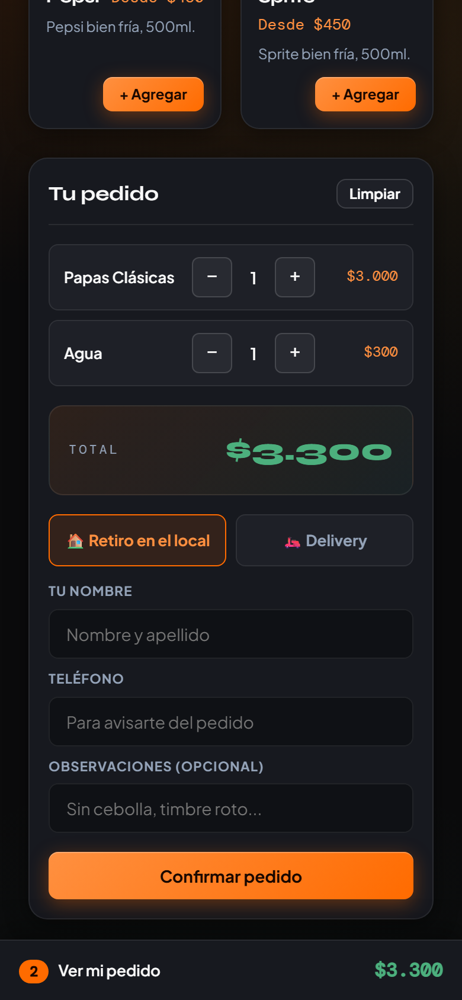
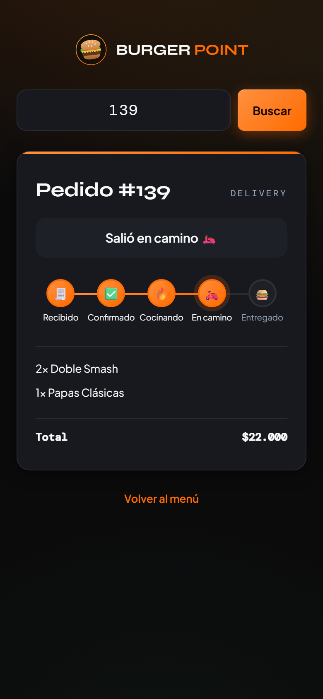
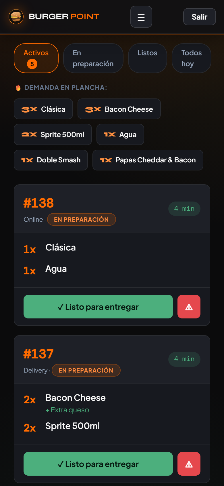
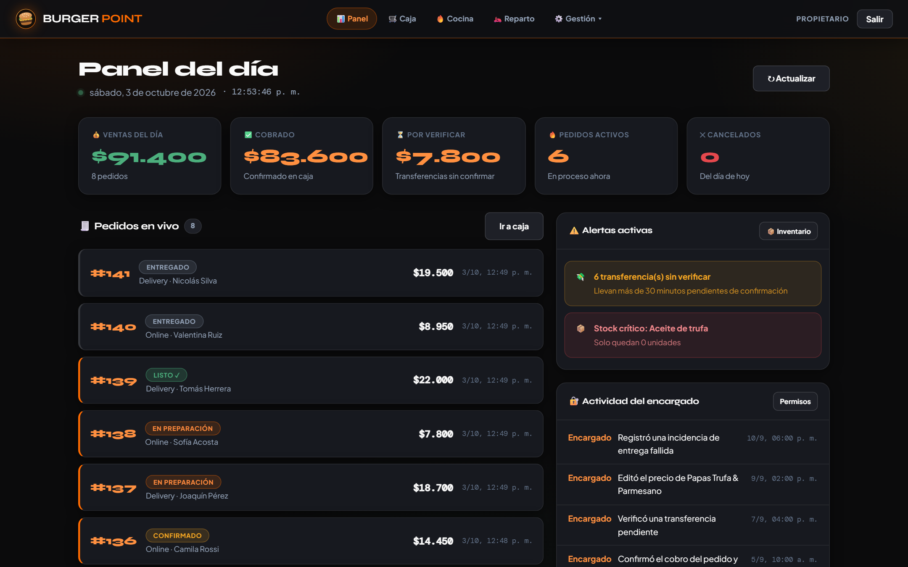
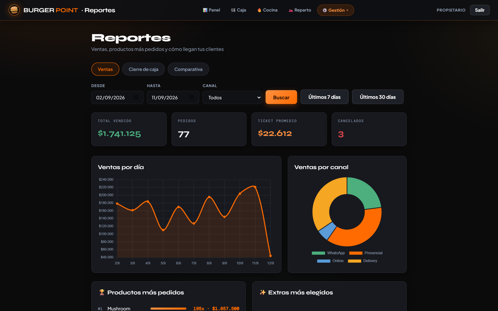

  

<h1 align="center">Burger Point</h1>

<b>Sistema de gestión integral para restaurantes</b> — pedidos, cocina, reparto, caja, inventario, clientes y reportes, en tiempo real.

  🔗 <a href="https://burger-point-vtlu.onrender.com">Demo en vivo</a> ·
  📋 <a href="CLAUDE.md">Historial completo de desarrollo</a>

---

## Qué es esto

Burger Point nació como el trabajo final de la carrera, pero terminó siendo un sistema completo de punta a punta: un cliente hace un pedido desde el menú digital (sin necesidad de cuenta ni de instalar nada), caja lo confirma y cobra, cocina lo prepara con un temporizador que avisa si se está demorando, reparto lo entrega o verifica la transferencia, y el propietario ve todo — ventas, alertas de stock, actividad del encargado — desde un panel en vivo.

No es un mockup ni un prototipo: **cada pantalla habla con una base de datos real (Supabase/PostgreSQL)**, descuenta stock de verdad al confirmar una venta, genera una factura en PDF con numeración correlativa, y está desplegado en producción.

## Capturas

  
  
  

Del celular del cliente a la cocina: el pedido, su seguimiento y la pantalla de cocina.

  
  

Panel del dueño con ventas y alertas en vivo, y reportes por período y canal.

## Funcionalidades principales

**Para el cliente** (sin necesidad de cuenta)
- Menú digital con stock en vivo, personalización de productos (extras, variantes por tamaño) y promociones con descuento automático
- Seguimiento del pedido en tiempo real por número, con pasos según el canal (retiro / delivery)
- Perfil liviano reconocido por teléfono (sin contraseña) que arma un historial de fidelización solo
- Canal directo para dejar una queja, sin depender de que caja la cargue

**Para el equipo** (caja / cocina / reparto)
- Caja: alta de pedidos con validación de stock, cobro (efectivo / tarjeta / transferencia), factura en PDF con formato de Factura A argentina
- Cocina: cola de pedidos con temporizador por color según urgencia, y una barra de "demanda en plancha" que agrupa cuánto hay que cocinar de cada producto
- Reparto: entregas del turno, verificación de transferencias pendientes

**Para la gestión** (propietario / encargado con permisos)
- Panel con estadísticas en vivo, alertas de stock crítico y feed de actividad
- Reportes: ventas por período/canal, cierre de caja con resumen automático en lenguaje natural, comparativa contra el período anterior
- Inventario con historial de ingresos, precios y promociones editables, registro de clientes con detección de frecuentes/cumpleaños
- Permisos granulares por sección para el rol de encargado
- **Marca 100% configurable** (`/configuracion.html`): nombre, logo, color y datos fiscales del negocio se editan desde la interfaz, sin tocar código — pensado para poder adaptar el mismo sistema a otro negocio

## Se adapta al tamaño del local

No hace falta una pantalla por puesto. Funciona en cualquier navegador (celular, tablet o PC), y **Caja sola puede llevar un pedido de punta a punta**: pasarlo a cocina, marcarlo listo y entregado. Un local chico puede trabajar con un único celular; si crece, cada puesto (caja, cocina, reparto) suma su propio dispositivo y su propio usuario, sin cambiar nada del sistema.

## Stack técnico

- **Backend**: Node.js + Express 4, JWT para auth, bcrypt para contraseñas, PDFKit para las facturas
- **Base de datos**: Supabase (PostgreSQL) con Row Level Security activado en las 19 tablas
- **Frontend**: HTML/CSS/JS sin framework, sistema de diseño propio ("Artisan Ember")
- **Deploy**: Render, con auto-deploy en cada push a `main`

## Cómo probarlo

El [link de arriba](https://burger-point-vtlu.onrender.com) abre directo el menú digital — se puede armar un pedido sin loguearse. El sistema corre en un plan gratuito que se "duerme" tras 15 minutos sin uso, así que el primer request del día puede tardar hasta un minuto (el menú avisa que está arrancando y se recupera solo, no hace falta recargar).

Para ver el panel de administración (caja, cocina, panel del propietario, etc.) hay usuarios demo por rol — escribime y te los paso.

## Documentación

Todo el proceso de desarrollo — decisiones, bugs reales encontrados y cómo se resolvieron, qué se probó y cómo — está documentado en [`CLAUDE.md`](CLAUDE.md) en orden cronológico, sección por sección.
